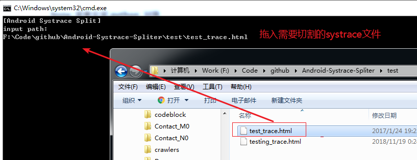
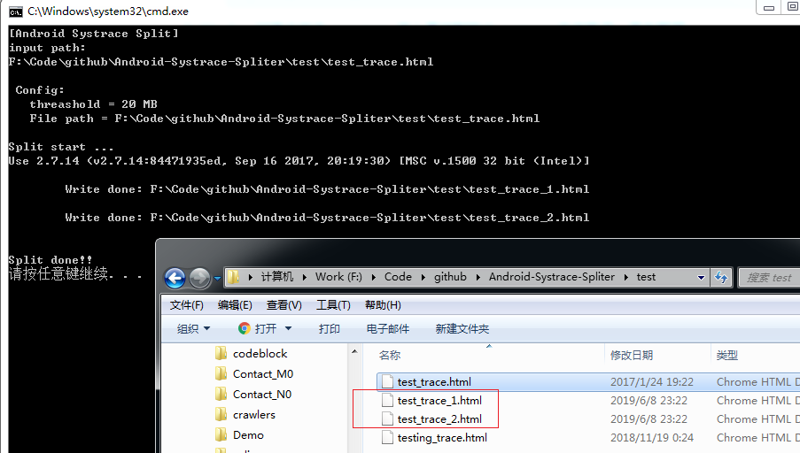

# Android-Systrace-Spliter
## Description

`Systrace` 是分析 Andriod  Performance 问题的重要工具，但是有时候分析问题时，实际抓取的 systrace 文件 size 过大 ( 根据各个PC配置能力，比如 300 MB），不能直接打开(崩溃)。此工具可以将 Systrace 源文件切割成多份小 size 的文件打开。

**Need**

* python  环境

## How to use
1. 配置切割文件的最大 size 

   * 修改 `run.bat`中的 `threshold` 值，例如，这里为 20 MB

     ```bash
     REM threshold config
     set threshold=20
     ```
   
2. Window 环境中双击 `run.bat`, 拖入要切割的大size 的 systrace 文件路径，回车即可




3. 在原文件目录会生成新切割后的文件，分开打开即可




## TODO

- [ ] 切割后的各 systrace 文件，原始时间能标记，而不是都是 0s 开始